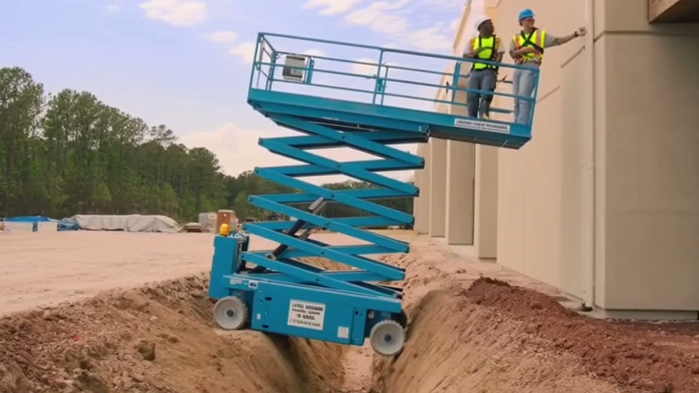

# OmniGaurd

**AI-powered real-time safety monitoring for construction sites using multi-agent systems**

**Track:** NVIDIA Nemotron

---

## Overview

Construction Safety AI analyzes construction site videos to detect safety hazards using a multi-agent system powered by **NVIDIA Nemotron Nano 9B v2**. The system combines vision-language models for video understanding with specialized safety agents for comprehensive hazard detection and response.

## Architecture

### System Architecture

```
┌─────────────────────────────────────────────────────────────┐
│                      Frontend (React)                        │
│  - Video Upload/Recording UI                                 │
│  - Agent Flow Visualization                                  │
│  - Real-time Analysis Display                                │
└────────────────────────┬────────────────────────────────────┘
                         │ HTTP/REST
                         ↓
┌─────────────────────────────────────────────────────────────┐
│                   Backend (FastAPI)                          │
│  - Video Processing Pipeline                                 │
│  - API Endpoints (/api/analyze)                              │
│  - CORS & File Handling                                      │
└──────────────┬──────────────────────┬───────────────────────┘
               │                      │
               ↓                      ↓
┌──────────────────────────┐  ┌────────────────────────────────┐
│  Vision Pipeline         │  │  Agent System (Nemotron)       │
│  - Gemini VLM            │  │  - Safety Router Agent         │
│  - Frame Extraction      │  │  - EMS Safety Agent            │
│  - Event Detection       │  │  - Fire Safety Agent           │
└──────────────────────────┘  │  - PPE Compliance Agent        │
                              └────────────────────────────────┘
```

### Agent Architecture

The system uses a **hierarchical multi-agent system** with tool-calling capabilities:

```
User Video Input
       │
       ↓
┌──────────────────────────────────────────────────────────────┐
│              Safety Router Agent (Coordinator)                │
│  - Analyzes scenario                                          │
│  - Routes to appropriate specialist                           │
│  - Priority: EMS > Fire > Compliance                          │
└─────────┬────────────────┬────────────────┬──────────────────┘
          │                │                │
          ↓                ↓                ↓
    ┌─────────┐      ┌─────────┐     ┌──────────────┐
    │   EMS   │      │  Fire   │     │  Compliance  │
    │  Agent  │      │  Agent  │     │    Agent     │
    └────┬────┘      └────┬────┘     └──────┬───────┘
         │                │                  │
         └────────────────┴──────────────────┘
                         │
                    Tool Calls
         ┌───────────────┼───────────────┐
         ↓               ↓               ↓
    detect_ems     detect_fire    detect_compliance
         ↓               ↓               ↓
    send_site_alert  (shared notification tool)
```

**Agent Handoff Flow:**
1. **Router** receives video analysis event
2. **Router** identifies hazard type and routes to specialist
3. **Specialist** executes domain-specific tools
4. **Specialist** returns findings to Router
5. **Router** compiles comprehensive safety report

## Tech Stack

**Core AI:**
- **NVIDIA Nemotron Nano 9B v2** - Multi-agent reasoning and tool calling
- **Google Gemini** - Vision-language model for video analysis

**Backend:**
- **FastAPI** - REST API server
- **Python 3.11** - Core runtime
- **OpenAI SDK** - NVIDIA API integration

**Frontend:**
- **React + TypeScript** - UI framework
- **Material-UI (MUI)** - Component library
- **Vite** - Build tool

**Agent Framework:**
- Custom agent system with handoffs
- Tool execution engine
- Structured logging and tracing

## Quick Start

### Prerequisites

- Python 3.11+
- Node.js 18+
- NVIDIA API key
- Google Gemini API key

### 1. Environment Setup

Create `.env` file in project root:

```bash
NVIDIA_API_KEY=nvapi-your-key-here
GEMINI_API_KEY=your-gemini-api-key
```

### 2. Install Dependencies

**Backend:**
```bash
# Install Python dependencies
uv sync

# Or with pip
pip install -r requirements.txt
```

**Frontend:**
```bash
cd frontend
npm install
```

### 3. Run the Application

**Backend (Terminal 1):**
```bash
# From project root
./run_backend.sh

# Or manually
cd api
uvicorn main:app --reload --host 0.0.0.0 --port 8000
```

**Frontend (Terminal 2):**
```bash
cd frontend
npm run dev
```

**Access the app:** http://localhost:5173

### 4. Test with Sample Video

**Using the provided example:**


*Sample test video generated with OpenAI Sora 2*

```bash
# Sample video located at:
examples/sample_construction_site.mp4
```

1. Open the web interface at http://localhost:5173
2. Click "Upload Video" tab
3. Upload `examples/sample_construction_site.mp4` (or record your own)
4. Click "Analyze Video"
5. View agent execution flow and safety findings in real-time

## How It Works

### Video Analysis Pipeline

1. **Video Upload/Recording** → Frontend captures or uploads video
2. **Frame Extraction** → Backend processes video into frames
3. **Vision Analysis** → Gemini VLM analyzes frames for hazards
4. **Event Detection** → System identifies safety events with metadata
5. **Agent Routing** → Safety Router determines appropriate specialist
6. **Tool Execution** → Agents call detection and notification tools

### Agent Tools

**EMS Safety Agent:**
- `detect_ems_hazard` - Identifies medical emergencies
- `send_site_alert` - Dispatches emergency notifications

**Fire Safety Agent:**
- `detect_fire_hazard` - Detects fire risks and ignition sources
- `send_site_alert` - Sends fire safety alerts

**Compliance Agent:**
- `detect_compliance_violation` - Checks PPE and safety equipment
- `send_site_alert` - Issues compliance warnings

### Example Response

```json
{
  "status": "success",
  "video_id": "api_20251026_094830",
  "event": {
    "safety_status": "HIGH",
    "incident_type": "Fall Hazard",
    "description": "Worker at elevated height without fall protection"
  },
  "agent_output": "Safety Router → Compliance Agent: Missing fall protection harness at 12ft height. Immediate stop work order issued.",
  "trace": [
    {
      "agent_name": "Safety Router Agent",
      "duration_ms": 3642,
      "tool_calls": [],
      "handoff_to": "PPE Compliance Agent"
    },
    {
      "agent_name": "PPE Compliance Agent",
      "duration_ms": 5234,
      "tool_calls": [
        {
          "tool_name": "detect_compliance_violation",
          "success": true,
          "result": "Fall protection violation confirmed"
        }
      ]
    }
  ]
}
```

## Project Structure

```
safety-agent/
├── agent/                      # Multi-agent system (Nemotron)
│   ├── safety_agents.py        # Agent definitions and routing
│   ├── src/
│   │   ├── agent.py            # Agent base class
│   │   ├── runner.py           # Agent execution engine
│   │   ├── tools.py            # Tool execution framework
│   │   └── logger.py           # Trace logging
│   └── tools/
│       ├── ems_tools.py        # Medical emergency detection
│       ├── fire_tools.py       # Fire hazard detection
│       ├── compliance_tools.py # PPE compliance checks
│       └── notification_tools.py # Alert system
├── api/                        # FastAPI backend
│   ├── main.py                 # REST API endpoints
│   └── requirements.txt
├── frontend/                   # React web app
│   ├── src/
│   │   ├── App.tsx             # Main application
│   │   ├── components/
│   │   │   ├── VideoUpload.tsx
│   │   │   ├── VideoRecorder.tsx
│   │   │   └── AgentFlowGraph.tsx
│   │   └── types.ts
│   └── package.json
├── pipeline/                   # Video processing
│   └── pipeline.py             # Gemini VLM integration
├── examples/                   # Example test videos
│   ├── sample_construction_site.mp4  # Sample video for testing
│   └── sample_construction_site.jpg  # Preview image (Sora 2 generated)
└── deploy/                     # Deployment configs
```

## Datasets & Synthetic Data

**Video Sources:**
- Public construction safety datasets
- Synthetic safety scenario videos generated using OpenAI Sora 2
- Real-world construction footage (anonymized)

**Synthetic Data Generation:**
- Used Sora 2 to create controlled test scenarios for system validation
- Generated videos covering edge cases (poor lighting, occlusions, multi-hazard scenarios)
- Enabled testing without exposing real workers to dangerous situations
- Example video included: `examples/sample_construction_site.mp4` (Sora 2 generated)

**Event Annotations:**
- Safety violations detected by Gemini VLM
- Structured JSON format with hazard metadata
- Confidence scores and spatial localization

**Provenance:**
- All video datasets follow construction safety standards (OSHA, ANSI)
- Video preprocessing ensures privacy compliance
- Synthetic scenarios enable comprehensive testing coverage

## Known Limitations

1. **Video Quality** - Performance degrades with low resolution (<480p) or poor lighting
2. **Occlusion** - Partially obscured hazards may not be detected
3. **Domain Coverage** - Optimized for common construction scenarios
4. **Real-time Constraints** - Processing takes 10-30s per video (not sub-second)
5. **False Positives** - May flag safe scenarios that visually resemble hazards

## Next Steps

**Near Term:**
- [ ] Finetune vision models with Sora 2 generated dataset for better hazard alignment
- [ ] Real-time video streaming support
- [ ] Multi-camera view fusion
- [ ] Custom safety rule configuration
- [ ] Historical incident database
- [ ] SMS/email alert integration

**Long Term:**
- [ ] Edge deployment (on-site processing)
- [ ] Multi-language support
- [ ] Wearable device integration
- [ ] Predictive incident modeling
- [ ] Regulatory compliance reporting
